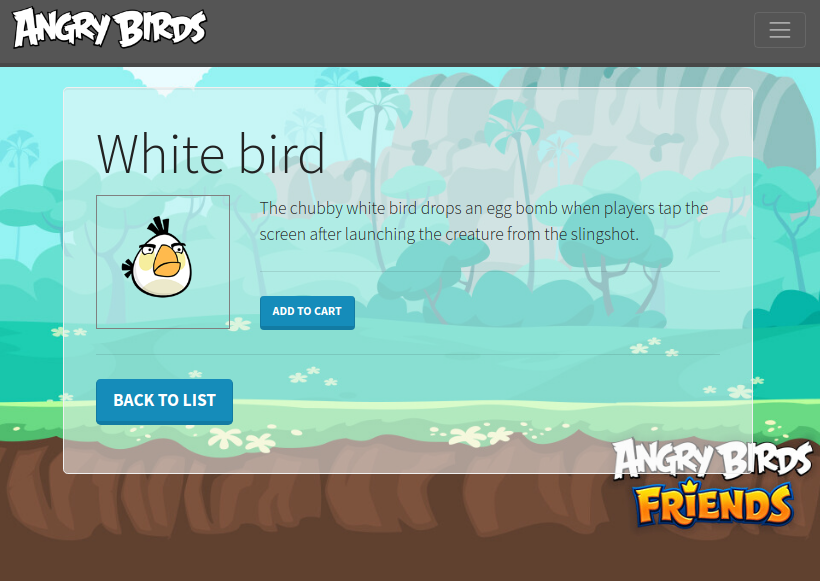

# Exercice Getting started

Vous allez mettre en place un site de fan sur les Angry Birds ! Analysons les contenus fournis pour entrevoir les fonctionnalités attendues. Les étapes de l'exercice sont détaillées ensuite.

## Exemples de rendu

### 1. Liste

<kbd></kbd>

### 2. Oiseau

<kbd></kbd>

---

### Objectifs

- Installer Symfony Skeleton
- L'enrichir au besoin via la documentation de Symfony section _Getting Started_
- Parcourir la documentation Twig (moteur de templating)
- Créer un site de fans sur les Angry Birds !

Vous travaillerez à partir de [la documentation Symfony : Getting Started](https://symfony.com/doc/current/index.html).

> :hand: **Toutes les infos sont contenues dans les chapitres du _Getting Started_**. Pas besoin d'aller chercher les infos ailleurs pour le moment.

## Etapes de l'exercice

**Installation**

Installer un nouveau projet Symfony "skeleton", via l'utilitaire _symfony_ : `composer create-project symfony/skeleton angrybirds` et entrer dans le dossier du projet avec `cd angrybirds`.

> :hand: Si besoin de passer par Apache, on installe le `.htaccess` via `composer require apache-pack`.
> :hand: Sinon, on peut utiliser le serveur PHP `php -S 0.0.0.0:8000 -t public`.

**Les routes**

> :hand: Lister les pages attendues afin d'en déduire les routes (URL, contrôleur, méthode, paramètres, description). Les noter dans un fichier de routes en markdown par ex.

**Les assets**

Dans le dossier `public` créer 2 sous-dossiers `images` et `files` et importer les fichiers de ressources dans leurs dossiers respectifs.

> On s'occupera du fichier `data.php` dans quelques minutes.

> :hand: A ce stade la structure de notre site est en place, il ne nous reste plus qu'à coder les fonctionnalités !

---

**Liste des oiseaux**

Aux étapes suivantes, créer les contrôleurs, méthodes et templates nécessaires.

- Bien que le _yaml_ reste possible pour l'écriture des routes, les annotations sont recommandées : les inclure au projet via `composer require annotations`
- Vous pourrez afficher les routes dans le terminal avec `debug:router`.

1. Récupérer la liste des oiseaux et la dumper via `dump()` depuis la page d'accueil.
   - **`data.php` (Model)** : Pour ce faire, trouver le moyen d'intégrer les données fournies dans le projet Symfo (on cherchera une solution en PHP objet de préféfence :wink:). Pas de bases de données pour le moment, on voit ça en S02 :wink:
2. Créer la vue associée avec l'héritage du layout principal (Twig) d'après la capture fournie (rubrique _Templates_).
   - Si besoin de Twig, l'inclure au projet via `composer require twig` :paintbrush:
3. Afficher les données brutes dans la vue (on affichera les images et on créera les liens ensuite). Cf : Boucle [for de Twig](https://twig.symfony.com/doc/3.x/tags/for.html)

> Vous souhaitez des infos sur l'exécution de votre code ? => `composer require profiler` :tada:

**Liens et images**

Dans la boucle du template de liste :

1. Afficher l'image de chaque oiseau (rubrique _Templates > Linking to Assets_).
2. Générer des liens avec l'id de l'oiseau concerné (rubrique _Templates > Linking to Pages_). Trouver le moyen d'identifier un oiseau depuis le tableau.

**Show bird**

1. Récupérer l'index de l'oiseau à afficher depuis l'URL et le dumper pour vérification (rubrique _Routing_).
2. Récupérer le data de l'oiseau, le donner à la vue et afficher le détail complet (rubrique _Templates_).
   - Créer la vue associée avec l'héritage du layout principal d'après la capture fournie.
3. Que faire si l'index n'existe pas dans les data ? (pensez _"HTTP"_ cf rubrique _Controllers_)
4. Créer le lien vers la page d'accueil.

**Routes (suite)**

Que faire si le paramètre `id` de la route `bird_show` n'est pas au format numérique ? Essayez de passer une chaine de caractères dans l'URL pour voir.

- Trouver le moyen de mettre des contraintes sur les paramètres de routes, ici sur l'id de l'oiseau qui doit être un entier (rubrique _Routing > Parameters Validation_).

**PDF**

Trouver le moyen de _forcer le téléchargement direct_ du PDF _sans chargement d'une nouvelle page_ (rubrique _Controllers > Streaming File Responses_).

**API**

Cela n'est pas précisé dans les captures mais vous pourriez proposer un accès API/JSON qui renvoie les données des oiseaux vers une appli front.
- Récupérer l'ensemble des data et les encoder en JSON (rubrique _Controllers > Returning JSON Response_).

**Front: CSS et Twig cycle()**

1. Intégrer la maquette ou un thème de votre choix, au plus simple/rapide :wink:
2. Gérer l'alternance de couleurs avec la fonction [cycle de Twig](https://twig.symfony.com/doc/3.x/functions/cycle.html)

## Lectures

- Parcourir [les conventions de codage et de nommage de Symfony](https://symfony.com/doc/current/contributing/code/standards.html).  
Elles vous permettront d'avoir **une base pour l'écriture de votre code**.
- [Les fondamentaux HTTP, vus par Symfony](https://symfony.com/doc/current/introduction/http_fundamentals.html).
